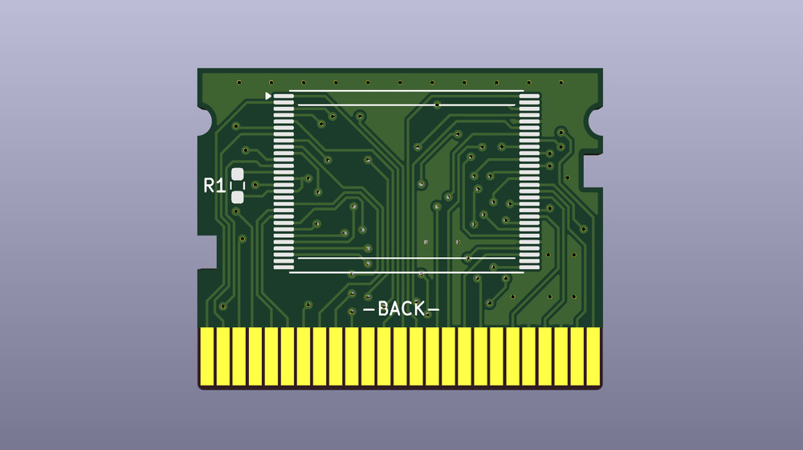

#### Картридж для карманной консоли MD Portable

В основе картриджа одна микросхема Flash ROM в корпусе TSOP48 или TSOP56, в зависимости от объема памяти. Для прошивки игры нужен отдельный программатор.

ВНИМАНИЕ, сторона с чипом памяти является обратной стороной по отношению к экрану MD Portable.
Многоигровки на Flash объемом 8МБ и выше не тестировались.

Проект создан в [**KiCad 9**](https://www.kicad.org/).

#### Параметры для изготовления PCB
* 2 слоя
* Толщина PCB: 1.2 мм
* Рекомендуется ENIG покрытие контактов краевого разъема
